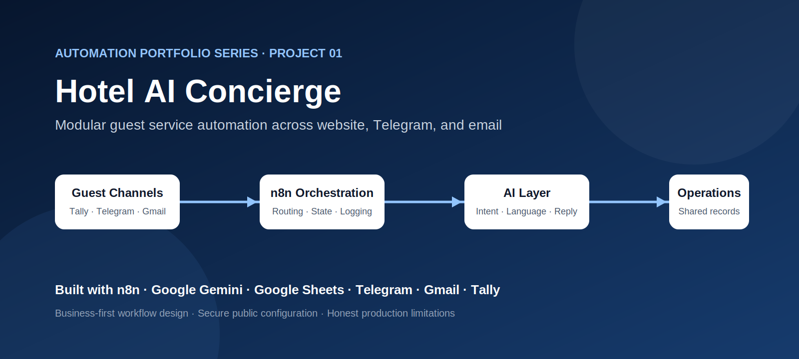
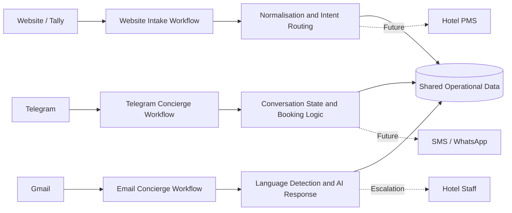

<div align="center">t

# Hotel AI Concierge Automation

### A modular, multi-channel guest service automation built with n8n


**Project 01 — Automation Portfolio Series**

[Business Problem](#business-problem) ·
[Solution](#solution) ·
[Architecture](#architecture) ·
[Workflows](#workflow-overview) ·
[Setup](#local-setup-and-configuration) ·
[Roadmap](#roadmap)

</div>



> **Portfolio note:** Hotel Adriatica is a fictional demonstration property created for this project. The workflows illustrate architecture, orchestration, documentation, and secure configuration practices. They are not presented as a production hotel system.

---

## Executive summary

Hotels often receive the same operational questions through several disconnected channels: room availability, check-in times, restaurant hours, booking requests, transport questions, and room-service enquiries.

When these requests are handled manually, staff must repeatedly switch between inboxes, copy information into spreadsheets, and answer routine questions that follow predictable patterns.

This project demonstrates a modular automation system in which three independent n8n workflows handle website forms, Telegram conversations, and email enquiries. All three workflows connect to a shared operational data layer so guest activity can be reviewed in one place.

The project is designed to demonstrate:

- business-process analysis before automation;
- multi-channel workflow architecture;
- structured guest-data normalisation;
- intent classification and response generation;
- stateful Telegram conversations;
- secure configuration using credentials and environment variables;
- documentation suitable for review, handover, and further development;
- transparent limitations rather than overstating production readiness.

---

## Business problem

A small or mid-sized hotel may receive guest requests from several sources:

- website enquiry forms;
- messaging applications;
- email;
- telephone or SMS;
- online travel platforms.

The operational difficulty is not simply message volume. The larger problem is fragmentation.

Guest details may be stored differently in every channel. Booking information may be incomplete. Staff may repeat the same answers. There may be no shared log of who asked what, when a response was sent, or whether the issue was resolved.

The manual process creates several risks:

1. **Slow response time**  
   Staff may not see messages immediately when requests arrive in different inboxes.

2. **Inconsistent guest experience**  
   Different employees may provide different answers or omit important booking information.

3. **Repetitive administrative work**  
   Guest details are copied manually into spreadsheets or reservation notes.

4. **Limited operational visibility**  
   Management cannot easily review enquiry volume, common intents, language, or escalation needs.

5. **Difficult expansion**  
   Adding another channel often creates another isolated process rather than extending one maintainable system.

---

## Solution

The system separates each communication channel into an independently deployable n8n workflow.

Each workflow is responsible for:

- receiving a channel-specific payload;
- converting it into a structured internal format;
- identifying the guest's intent;
- generating or selecting an appropriate response;
- recording the interaction;
- passing sensitive or unsupported cases to a human process.

A shared Google Sheets workbook acts as the demonstration operational layer. It stores conversation logs, session state, and booking-related details.

This modular approach was chosen instead of one large workflow because it provides clearer ownership, simpler testing, and easier troubleshooting.

---

## Current channel status

| Channel | Status | Primary responsibility |
|---|---|---|
| Website / Tally | Implemented demonstration | Structured booking and guest-request intake |
| Telegram | Implemented demonstration | Interactive concierge, booking flow, FAQs, and session state |
| Gmail | Implemented demonstration | Language and intent detection, AI-assisted response, and interaction logging |
| SMS / Twilio | Planned | Booking notifications and guest messaging |
| WhatsApp Cloud API | Planned | Conversational guest support |
| Production PMS | Simulated / planned | Authoritative room availability and reservation actions |

The repository does not claim that SMS, WhatsApp, or a production PMS are currently operational.

---

## Architecture




### Design principles

**Modularity**  
A channel can be changed without redesigning every guest journey.

**Separation of concerns**  
Triggers, parsing, business logic, response delivery, and logging are kept conceptually distinct.

**Shared visibility**  
Operational records from multiple channels can be reviewed in one place.

**Secure configuration**  
Secrets are not stored in public workflow exports.

**Honest scope**  
Simulated integrations and planned channels are labelled clearly.

---

## Workflow overview

### 1. Website and Tally intake

**File:** [`website-tally-concierge.json`](website-tally-concierge.json)

This workflow receives a structured form submission and converts the submitted fields into a consistent guest-request object.

It demonstrates:

- payload normalisation;
- channel detection;
- guest contact extraction;
- AI-assisted intent classification;
- request routing;
- optional PMS integration points;
- logging to the shared operational workbook;
- controlled webhook responses.

A production implementation should validate the form schema, verify webhook authenticity, handle duplicate submissions, and connect to an authoritative reservation system.

---

### 2. Telegram concierge

**File:** [`telegram-concierge.json`](telegram-concierge.json)

The Telegram workflow manages a step-by-step guest conversation.

It demonstrates:

- Telegram webhook payload parsing;
- inline menu and callback handling;
- session retrieval and persistence;
- conversation-state transitions;
- booking information collection;
- FAQ responses;
- room-service and staff-request paths;
- guest confirmation;
- shared logging.

The state-machine approach prevents the workflow from treating every message as an isolated request. Instead, it remembers the current step of the guest journey.

---

### 3. Email concierge

**File:** [`email-concierge.json`](email-concierge.json)

The email workflow monitors new enquiries, extracts the message context, detects language and intent, generates an AI-assisted reply, sends the response through Gmail, and records the interaction.

It demonstrates:

- Gmail trigger configuration;
- sender and message parsing;
- multilingual keyword detection;
- AI prompt construction;
- fallback response handling;
- HTML email preparation;
- outbound Gmail delivery;
- conversation logging.

For production use, sensitive requests, complaints, payment questions, refunds, and high-urgency messages should require human review.

---

## Data model

The demonstration uses one Google Sheets workbook with separate tabs.

Recommended tabs include:

- `Conversations`
- `Telegram_Sessions`
- `Telegram_Log`
- `Email_Log`

Detailed columns are documented in:

- [`docs/google-sheets-schema.md`](docs/google-sheets-schema.md)
- [`sample-data/google-sheets-schema.csv`](sample-data/google-sheets-schema.csv)

Google Sheets is intentionally used because it makes the workflow easy to inspect in a portfolio setting. It is not presented as the ideal database for a high-volume hotel operation.

---

## Security and privacy

No public repository should contain:

- API keys;
- Telegram bot tokens;
- OAuth secrets;
- n8n credential metadata;
- private Google Sheets identifiers;
- production webhook identifiers;
- real guest names, email addresses, phone numbers, or booking data.

The public workflow files use credential references and environment-variable placeholders.

Review:

- [`SECURITY.md`](SECURITY.md)
- [`docs/sanitisation-report.md`](docs/sanitisation-report.md)
- [`.env.example`](.env.example)

Any credential that appeared in an earlier private export should be rotated before the repository is published.

---

## Local setup and configuration

### Prerequisites

- an n8n instance;
- Google Sheets access;
- Gmail OAuth access;
- a Telegram bot;
- a Google Gemini API key;
- a Tally form or equivalent website form.

### Setup sequence

1. Clone or download the repository.
2. Review `.env.example`.
3. Configure secrets privately in the n8n environment or credential manager.
4. Create the recommended Google Sheets tabs.
5. Import one workflow at a time.
6. Select the correct credentials in every node.
7. verify sheet names and column mappings.
8. Configure Tally and Telegram webhooks.
9. Test with fictional guest data.
10. Activate workflows only after each branch has been validated.

Full instructions:

- [`docs/setup-guide.md`](docs/setup-guide.md)
- [`docs/configuration-reference.md`](docs/configuration-reference.md)
- [`docs/testing-checklist.md`](docs/testing-checklist.md)

---

## Repository structure

```text
hotel-ai-concierge-automation/
├── .github/
│   ├── ISSUE_TEMPLATE/
│   ├── pull_request_template.md
│   └── workflows/
│       ├── validate-json.yml
│       └── secret-pattern-check.yml
├── assets/
│   ├── project-cover.svg
│   └── architecture-diagram.svg
├── docs/
│   ├── architecture.md
│   ├── business-problem.md
│   ├── configuration-reference.md
│   ├── google-sheets-schema.md
│   ├── limitations-and-roadmap.md
│   ├── portfolio-screenshot-guide.md
│   ├── publishing-plan.md
│   ├── sanitisation-report.md
│   ├── setup-guide.md
│   └── testing-checklist.md
├── sample-data/
│   └── google-sheets-schema.csv
├── workflows/
│   ├── website-tally-concierge.json
│   ├── telegram-concierge.json
│   └── email-concierge.json
├── .env.example
├── .gitignore
├── CHANGELOG.md
├── CODE_OF_CONDUCT.md
├── CONTRIBUTING.md
├── LICENSE
├── SECURITY.md
└── README.md
```

---

## Testing strategy

This repository includes configuration and behavioural test checklists rather than automated end-to-end tests against live third-party accounts.

The manual test matrix covers:

- valid and incomplete website submissions;
- unknown Telegram payloads;
- session continuation;
- invalid booking data;
- FAQ selection;
- email language detection;
- AI fallback behaviour;
- missing credentials;
- failed Google Sheets writes;
- escalation conditions;
- duplicate or repeated events.

See [`docs/testing-checklist.md`](docs/testing-checklist.md).

---

## Known limitations

- Google Sheets is used as a lightweight demonstration data layer.
- PMS availability and booking actions are simulated or incomplete.
- Human approval is not fully implemented for every sensitive scenario.
- Retry policies, monitoring, idempotency, and rate limiting require further hardening.
- Data retention and privacy rules require a production-specific design.
- The workflows require manual configuration after import.
- The repository does not include real hotel or guest data.
- SMS and WhatsApp workflows are not yet operational.

---

## Roadmap

### Near term

- add polished workflow screenshots;
- add a short Telegram booking demo GIF;
- standardise room information across all workflows;
- add explicit human-escalation branches;
- improve input validation and error handling.

### Next integrations

- Twilio SMS;
- WhatsApp Cloud API;
- production PMS or reservation API;
- database-backed session management;
- operational alerting.

### Production hardening

- webhook verification;
- idempotency controls;
- execution monitoring;
- structured audit logs;
- role-based access;
- data-retention rules;
- automated multilingual test cases.

---

## What this project demonstrates to reviewers

This repository is intended to make the reasoning behind the automation visible.

It demonstrates that I can:

- analyse a business process before selecting tools;
- translate channel-specific payloads into consistent data;
- design modular workflows rather than one difficult-to-maintain automation;
- manage conversation state;
- integrate AI and external APIs;
- protect public repositories from obvious secrets;
- document setup, limitations, and future work;
- prepare a workflow for technical review and handover.

---

## Author

**Syifa Annisa**  
AI Automation Specialist

Portfolio and professional links can be added here after the repository is published.

---

## Licence

This project is released under the MIT Licence. See [`LICENSE`](LICENSE).
