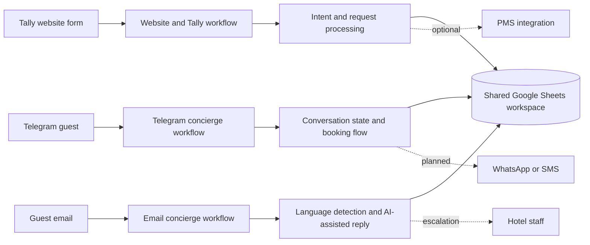

# Architecture

## Design approach

The solution uses a modular channel architecture rather than one large workflow.

## Why the workflows are separated

- **Maintainability:** a channel can be updated without changing every guest journey.
- **Testing:** failures can be isolated to one trigger and response mechanism.
- **Security:** each workflow can use only the credentials it requires.
- **Scalability:** additional channels can be added without rebuilding the entire system.
- **Operational visibility:** a shared data layer provides a consolidated record of guest activity.

## Shared data layer

Google Sheets is used as a demonstration database for:

- conversation logs;
- Telegram session state;
- website enquiries;
- email interactions;
- booking records.

For production, a relational database or hotel PMS would normally replace or complement Google Sheets.
